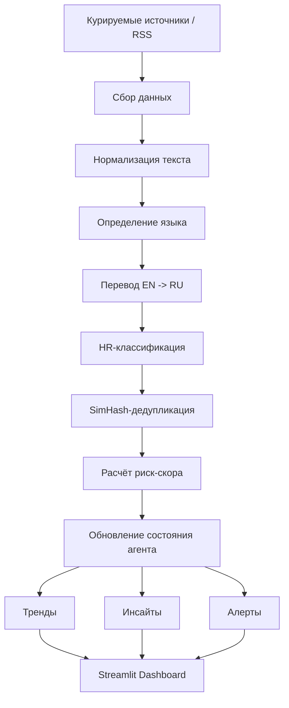

# Сценарий защиты MVP: HR AI Agent

> Цель документа: дать команде свежий сценарий защиты проекта, сфокусированный на MVP, методологии, ценности для HR-аналитика и отличиях от универсальных AI-инструментов.

## 0. Как пользоваться этим сценарием

Этот документ рассчитан на защиту длительностью **12–14 минут** и последующие **5 минут Q&A**.

Рекомендуемая логика выступления:

| Блок | Время | Смысл |
|---|---:|---|
| 1. Проблема | 1:30 | Показать боль HR-аналитика |
| 2. Решение и MVP | 2:00 | Объяснить, что именно уже работает |
| 3. Отличия от ChatGPT/Perplexity | 1:30 | Защитить уникальность проекта |
| 4. Архитектура | 2:00 | Показать инженерную состоятельность |
| 5. Методология источников | 1:30 | Показать, что данные не случайные |
| 6. Демо user journey | 2:00 | Провести комиссию по продукту |
| 7. Ограничения и roadmap | 1:30 | Показать зрелость и честность |
| 8. Финальный вывод | 0:30 | Закрепить ценность |

---

## 1. Проблема

HR-аналитик ежедневно сталкивается с информационной перегрузкой. Чтобы понимать, что происходит на рынке труда, ему приходится вручную просматривать новости, исследования, посты, отчёты и профессиональные обсуждения.

Ключевая боль:

- на мониторинг может уходить около **3 часов в день**;
- данные размазаны по **50+ источникам**: медиа, HR-ассоциации, карьерные платформы, аналитические отчёты, профессиональные сообщества;
- часть источников англоязычная, поэтому требуется перевод и адаптация;
- важные сигналы часто теряются среди информационного шума;
- HR-команда реагирует постфактум, а не заранее.

Пример: если в отрасли растёт число новостей о сокращениях, выгорании или дефиците навыков, HR-аналитик должен быстро понять, является ли это единичной новостью или формирующимся трендом. Вручную это сложно: нужно собрать данные, убрать дубли, классифицировать материалы, оценить риск и подготовить выводы для руководителя.

**Проблема не в отсутствии информации. Проблема в том, что информации слишком много, она не структурирована и не превращена в HR-решение.**

---

## 2. Решение

Мы разрабатываем **HR AI Agent** — AI-помощника для HR-аналитика, который превращает поток внешних HR-сигналов в структурированные инсайты и риск-алерты.

Наш MVP закрывает полный цикл:

1. собирает новости из курируемого пула источников;
2. переводит англоязычные материалы;
3. классифицирует материалы по HR-темам;
4. убирает дубли и похожие новости;
5. рассчитывает риск-скор;
6. сохраняет состояние агента;
7. показывает тренды, инсайты и алерты в дашборде.

### Ключевая формула решения

**Курируемый пул источников + HR-классификация + SimHash-дедупликация + риск-скор + персистентное состояние = раннее предупреждение для HR.**

### Что важно именно в MVP

Мы не пытаемся сразу построить тяжёлую enterprise HR-платформу. MVP проверяет главную гипотезу:

> Может ли AI-агент автоматически обнаруживать значимые HR-события во внешнем информационном потоке и превращать их в понятные сигналы для HR-специалиста?

---

## 3. Отличия от ChatGPT и Perplexity

ChatGPT и Perplexity — сильные универсальные инструменты, но они работают в другой логике. Обычно пользователь сам должен сформулировать запрос: что искать, где искать, как сравнивать и как интерпретировать.

Наш проект отличается тем, что он построен не как чат, а как доменный агент для конкретной HR-задачи.

| Критерий | ChatGPT / Perplexity | HR AI Agent |
|---|---|---|
| Логика работы | Пользователь задаёт вопрос | Агент сам обрабатывает поток источников |
| Источники | Широкий веб-поиск | Курируемый пул HR-источников |
| Контроль качества источников | Не всегда прозрачен | Источники проходят методологический отбор |
| HR-классификация | Нужно задавать промптом | Встроенная классификация по 7 HR-категориям |
| Дедупликация | Нет устойчивого доменного механизма | Автодедупликация через SimHash / similarity-подход |
| Состояние | Обычно сессионное | Персистентное состояние trends / insights / alerts |
| Результат | Ответ на вопрос | Дашборд с трендами, инсайтами и алертами |
| Риск-скор | Нужно отдельно проектировать | Встроенная оценка риска |
| Роль пользователя | Через промпт | Через роли analyst / partner / manager |

### 7 HR-категорий

В MVP используется тематическая HR-классификация по 7 категориям:

1. `hiring` — найм и рекрутинг;
2. `layoffs` — сокращения и увольнения;
3. `salaries` — зарплаты и компенсации;
4. `skills` — навыки и обучение;
5. `burnout` — выгорание и вовлечённость;
6. `culture` — корпоративная культура;
7. `diversity` — разнообразие и инклюзия.

Почему именно 7 категорий: это достаточный уровень детализации для MVP. Категорий достаточно, чтобы разделить основные HR-риски, но не настолько много, чтобы классификация стала нестабильной и непонятной для пользователя.

---

## 4. Архитектура

> TODO для команды: схему модулей запросить у Павленко / Буерашева и вставить сюда финальную картинку или Mermaid-схему.

### Текущая логика модулей



### Смысл архитектуры

Архитектура построена вокруг агентного цикла:

1. **Observe** — агент наблюдает за новыми источниками;
2. **Process** — переводит, чистит, классифицирует и дедуплицирует;
3. **Evaluate** — оценивает риск и сравнивает с историей;
4. **Act** — формирует инсайты, тренды и алерты.

### Основные компоненты

| Компонент | Назначение |
|---|---|
| Источники | RSS / новостные ленты / профессиональные площадки |
| Processing | перевод, нормализация, классификация |
| Deduplication | удаление дублей и похожих материалов |
| Rules | расчёт риск-скора, пороги, аномалии |
| State | персистентная память агента |
| Insights | генерация объяснений и рекомендаций |
| Dashboard | визуализация результата для пользователя |

---

## 5. Методология отбора источников

Одна из ключевых частей проекта — не просто “собрать новости”, а собрать новости из понятного и контролируемого пула источников.

### Почему нужен курируемый пул

Если использовать весь интернет, система будет получать много шума: рекламные тексты, SEO-материалы, дубли, низкокачественные публикации и нерелевантные новости. Поэтому в MVP мы используем курируемый пул источников, который можно оценивать, расширять и контролировать.

### Целевой пул

Для MVP и ближайшего развития целевой размер пула — около **20–30 источников**. Это компромисс между полнотой покрытия и управляемостью качества.

### Критерии качества источников

| Критерий | Что проверяем | Почему важно |
|---|---|---|
| Релевантность HR | Источник регулярно пишет о рынке труда, найме, зарплатах, культуре, навыках | Снижает шум |
| Авторитетность | У источника есть репутация, экспертиза или профессиональная аудитория | Повышает доверие к выводам |
| Регулярность обновлений | Источник публикуется стабильно | Агент получает свежие сигналы |
| Доступность | Есть RSS/API или стабильный способ получения данных | Источник можно автоматизировать |
| Географическое покрытие | РФ / международный рынок / IT / отраслевые источники | Позволяет сравнивать локальные и глобальные тренды |
| Язык | RU/EN | Англоязычные источники дают ранние глобальные сигналы |
| Уровень шума | Доля нерелевантных публикаций | Влияет на качество классификации |
| Дублируемость | Насколько часто источник перепечатывает чужие новости | Важно для дедупликации |
| Проверяемость | Можно ли открыть первоисточник | Важно для доверия комиссии и пользователя |

### Оценочная шкала источника

Каждый источник можно оценивать по 5-балльной шкале:

| Метрика | Вес |
|---|---:|
| HR-релевантность | 30% |
| Авторитетность | 20% |
| Частота обновления | 15% |
| Доступность для парсинга | 15% |
| Низкий уровень шума | 10% |
| Географическая / тематическая ценность | 10% |

Итоговый score помогает решить, оставлять источник в пуле или заменить.

---

## 6. Портреты целевой аудитории

Портреты строятся на ролях из конфигурации `USER_ROLES`: `analyst`, `partner`, `manager`.

### 6.1 HR-аналитик — `analyst`

**Фокус:** `salaries`, `hiring`, `layoffs`  
**Уровень детализации:** высокий

| Параметр | Описание |
|---|---|
| Сценарий | Аналитик утром запускает мониторинг за последние 24 часа, смотрит новости по зарплатам, найму и сокращениям, проверяет рост риск-скора и выгружает выводы для отчёта. |
| Ценность | Экономия времени на ручном мониторинге и подготовке первичного анализа. |
| Что видит в продукте | Подробные тренды, список источников, риск-скор, категории, объяснение причин риска. |
| KPI | Время подготовки обзора рынка, количество найденных значимых сигналов, точность классификации, доля дублей после фильтрации, скорость реакции на изменения рынка. |

### 6.2 HR-партнёр — `partner`

**Фокус:** `culture`, `burnout`, `skills`  
**Уровень детализации:** средний

| Параметр | Описание |
|---|---|
| Сценарий | HRBP отслеживает новости и сигналы, связанные с выгоранием, культурой и навыками, чтобы заранее предложить меры для бизнес-подразделения. |
| Ценность | Помогает переводить внешние сигналы в инициативы для конкретных команд. |
| Что видит в продукте | Средний уровень детализации: не вся лента, а ключевые инсайты и рекомендации. |
| KPI | Снижение времени реакции на HR-риски, количество предложенных инициатив, вовлечённость сотрудников, снижение риска выгорания, релевантность рекомендаций для бизнес-команд. |

### 6.3 HR-руководитель — `manager`

**Фокус:** `layoffs`, `hiring`, `diversity`  
**Уровень детализации:** summary

| Параметр | Описание |
|---|---|
| Сценарий | Руководитель HR смотрит краткую сводку: какие темы стали рискованными, что требует внимания и какие решения нужно вынести на уровень стратегии. |
| Ценность | Быстрое понимание картины без необходимости читать десятки материалов. |
| Что видит в продукте | Summary-режим: топ-риски, критичные алерты, динамика трендов, управленческие рекомендации. |
| KPI | Скорость принятия решений, количество предотвращённых рисков, качество стратегических HR-решений, своевременность эскалаций. |

---

## 7. Демо: user journey

### Сценарий демонстрации

**Роль:** HR-аналитик  
**Период:** последние 24 часа / последняя неделя  
**Фокус:** найм, сокращения, зарплаты  
**Цель:** показать, как из новостного шума получается управленческий сигнал.

### Шаг 1. Пользователь открывает дашборд

Мы показываем, что это не чат, а рабочее место HR-аналитика. Слева — настройки: роль, период анализа, чувствительность риска, приоритетные темы.

Что сказать:

> Здесь пользователь не пишет промпт. Он задаёт контекст своей роли, а дальше агент сам обрабатывает поток источников.

### Шаг 2. Выбор роли

Выбираем роль **HR-аналитик**. Система автоматически поднимает приоритеты: зарплаты, найм, сокращения.

Что сказать:

> Разные роли получают разные акценты. Аналитику нужна детализация, HR-партнёру — практические рекомендации для команд, руководителю — краткая сводка по критичным рискам.

### Шаг 3. Запуск цикла анализа

Нажимаем кнопку запуска анализа.

Что сказать:

> В этот момент агент проходит полный цикл: сбор новостей, перевод, классификация, дедупликация, оценка риска и обновление состояния.

### Шаг 4. Просмотр инсайтов

Показываем карточки инсайтов: что произошло, почему это важно, что делать.

Что сказать:

> Главное отличие от обычной новостной ленты — система не просто показывает статью, а объясняет её HR-значение.

### Шаг 5. Просмотр риск-алертов

Показываем новости, которые превысили порог риска.

Что сказать:

> Риск-скор помогает расставить приоритеты. HR-аналитику не нужно читать всё подряд: он начинает с самого важного.

### Шаг 6. Просмотр трендов

Показываем изменение риск-скора по категориям.

Что сказать:

> Персистентное состояние позволяет видеть не только отдельные новости, но и динамику: тема стала активнее, риск вырос, появилась аномалия.

### Шаг 7. Повторный запуск

Объясняем, что при следующем запуске агент не должен заново обрабатывать уже известные материалы.

Что сказать:

> Это важная агентная часть: система помнит обработанные URL, инсайты, алерты и тренды.

---

## 8. Ограничения MVP

Мы честно фиксируем ограничения, потому что MVP — это проверка гипотезы, а не финальная enterprise-система.

| Ограничение | Почему это нормально для MVP | Roadmap |
|---|---|---|
| Ограниченное число источников | Нужно проверить качество пайплайна до масштабирования | Расширить пул до 20–30 источников |
| Часть данных может быть demo/mock | Демо показывает механику работы | Подключить реальные API и больше RSS |
| Ручной запуск анализа | Удобно для демонстрации и контроля | Добавить cron / Celery |
| Локальное состояние | Быстро для прототипа | Перейти на PostgreSQL / Redis |
| Один пользователь | Достаточно для проверки user journey | Добавить авторизацию и роли |
| Риск-скор частично rule-based | Хорошо объясняется комиссии | Добавить ML/LLM-оценку и валидацию |
| Нет полноценной разметки качества | Нормально на этапе MVP | Собрать датасет и метрики precision/recall |
| Нет интеграции с внутренними HR-данными | Сейчас фокус на внешних сигналах | Добавить RAG по внутренним документам и HRIS/ATS |

---

## 9. Roadmap

### Ближайший этап

- расширить пул источников до 20–30;
- формализовать scoring источников;
- улучшить SimHash-дедупликацию;
- добавить сохранение метрик качества;
- подготовить тестовый набор новостей для проверки классификации.

### Следующий этап

- подключить PostgreSQL / Redis;
- добавить фоновые задачи через cron / Celery;
- сделать авторизацию и несколько пользователей;
- добавить экспорт отчётов;
- подключить Telegram / email / корпоративные уведомления.

### Долгосрочно

- интеграция с HeadHunter / SuperJob / внутренними HR-системами;
- RAG по внутренним HR-документам;
- прогнозирование рисков;
- персональные рекомендации по подразделениям;
- аналитика эффективности принятых HR-мер.

---

## 10. FAQ комиссии

### 1. Чем ваш проект отличается от ChatGPT?

ChatGPT — универсальный ассистент, которому нужно задать вопрос. Наш продукт — доменный HR-агент, который сам мониторит источники, классифицирует новости, дедуплицирует похожие материалы, считает риск-скор и сохраняет состояние. Пользователь получает не просто ответ, а поток инсайтов и алертов.

### 2. Чем отличается от Perplexity?

Perplexity хорош для поиска ответа по конкретному запросу. У нас другой сценарий: регулярный мониторинг курируемых HR-источников, контроль качества источников, HR-классификация, риск-скор и история трендов.

### 3. Почему именно 7 категорий, а не 100?

Для MVP важна стабильность и интерпретируемость. Семь категорий покрывают основные HR-риски и понятны пользователю. Если сделать 100 категорий, качество классификации будет сложнее проверить, а интерфейс станет перегруженным. Расширение возможно после сбора статистики ошибок.

### 4. Как вы тестировали классификацию?

На MVP-этапе тестирование можно проводить на наборе новостей, вручную размеченных командой. Сравниваем категорию агента с эталонной разметкой и считаем accuracy / precision по категориям. Также отдельно проверяем спорные случаи и ошибки между близкими классами, например `culture` и `burnout`.

### 5. Как вы тестировали дедупликацию?

Берём набор новостей с повторяющимися или похожими заголовками и проверяем, объединяет ли SimHash похожие материалы, но не склеивает разные новости. Метрики: доля найденных дублей, доля ложных склеек, количество оставшихся повторов.

### 6. Почему используете SimHash?

SimHash хорошо подходит для быстрой оценки похожести текстов. Он легче и быстрее, чем полноценное семантическое сравнение всех документов между собой, поэтому удобен для MVP и масштабирования новостного потока.

### 7. Как масштабируется система?

Источники можно расширять горизонтально: каждый источник обрабатывается как отдельный поток данных. Хранилище можно вынести в PostgreSQL, кэш и очередь задач — в Redis/Celery, а обработку запускать по расписанию. Это позволит перейти от ручного запуска к регулярному мониторингу.

### 8. Что с приватностью?

В MVP мы работаем в основном с открытыми внешними источниками. Для production-версии приватные HR-данные должны храниться отдельно, с авторизацией, разграничением доступа, логированием и настройкой того, какие данные можно отправлять во внешнюю LLM.

### 9. Вы обучаете свою модель?

На MVP-этапе мы не обучаем собственную большую модель. Мы используем LLM для перевода, классификации и генерации инсайтов, а доменную логику задаём через правила, категории, источники и состояние агента. В будущем можно дообучать классификатор на размеченных HR-новостях.

### 10. Почему это AI-агент, а не просто дашборд?

Потому что система имеет состояние, правила и действия. Она помнит обработанные материалы, применяет HR-логику, сама генерирует инсайты и алерты. Дашборд — это только интерфейс, а агентная логика находится в цикле обработки.

### 11. Откуда берётся риск-скор?

Риск-скор рассчитывается на основе признаков новости: темы, ключевых слов, важности источника, совпадения с приоритетами пользователя, уровня риска и динамики относительно истории. В MVP часть логики rule-based, чтобы её можно было объяснить и проверить.

### 12. Как понять, что инсайт полезный?

Полезный инсайт отвечает на три вопроса: что произошло, почему это важно для HR и что делать дальше. Качество можно проверять экспертной оценкой HR-специалистов: релевантность, полнота, практичность, отсутствие галлюцинаций.

### 13. Что будет, если источник публикует фейк или некачественный материал?

Именно поэтому используется курируемый пул и оценка качества источников. Источники можно исключать, снижать их вес или помечать как низкодоверенные. В дальнейшем можно добавить cross-source validation: если событие подтверждается несколькими независимыми источниками, доверие выше.

### 14. Как проект можно внедрить в компанию?

Первый этап — использовать его как внешний мониторинг HR-рисков. Второй — подключить внутренние документы и HR-данные. Третий — интегрировать с корпоративными каналами уведомлений и отчётности.

### 15. Что является главным результатом MVP?

Главный результат MVP — работающий сквозной пайплайн: от сбора внешних новостей до HR-классификации, дедупликации, риск-скора, персистентного состояния, инсайтов и алертов в дашборде.

---

## 11. Речь на 12–14 минут

### Вступление

Здравствуйте. Мы представляем проект HR AI Agent — AI-помощника для HR-аналитика, который помогает отслеживать внешние сигналы рынка труда и превращать их в понятные инсайты и риск-алерты.

Наша цель в MVP — проверить, может ли агент автоматически обрабатывать поток HR-новостей и помогать специалисту быстрее замечать важные изменения.

### Проблема

Сегодня HR-аналитик работает в условиях информационной перегрузки. Чтобы понимать, что происходит на рынке труда, нужно просматривать десятки источников: новости, исследования, отчёты, профессиональные сообщества, англоязычные публикации.

На такой мониторинг может уходить около трёх часов в день. При этом данные размазаны по большому числу источников, часть материалов дублируется, часть не относится к HR напрямую, а важные сигналы могут потеряться.

В итоге HR-команда часто работает реактивно: событие уже произошло, а аналитика появляется позже.

### Решение

Наше решение — HR AI Agent. Это агент, который собирает данные из курируемого пула источников, переводит англоязычные материалы, классифицирует их по HR-темам, удаляет дубли, оценивает риск и показывает результат в дашборде.

Главный результат для пользователя — не список ссылок, а понятная картина: какие HR-темы сейчас становятся рискованными, какие события требуют внимания и что можно сделать дальше.

### Почему это не ChatGPT и не Perplexity

ChatGPT и Perplexity — универсальные инструменты. Они хорошо отвечают, если пользователь уже знает, что спросить. Но в нашей задаче проблема другая: HR-аналитик может ещё не знать, какая тема стала важной.

Наш агент работает проактивно. Он не ждёт вопроса, а сам регулярно обрабатывает источники. Кроме того, у него есть доменная HR-классификация, дедупликация, риск-скор и персистентное состояние.

### Архитектура

Архитектура строится вокруг агентного цикла. Сначала агент получает данные из источников. Затем нормализует текст, определяет язык и переводит англоязычные материалы. После этого классифицирует материал по HR-теме, удаляет дубли, рассчитывает риск-скор и обновляет состояние.

Состояние включает обработанные URL, тренды, инсайты и алерты. Именно это отличает агента от обычного дашборда: он помнит предыдущие наблюдения и может сравнивать новое состояние с историей.

### Методология источников

Отдельное внимание мы уделяем источникам. Мы не хотим просто брать весь интернет, потому что это создаёт шум. Вместо этого мы используем курируемый пул источников и оцениваем их по критериям: HR-релевантность, авторитетность, частота обновления, доступность для парсинга, уровень шума и географическая ценность.

Целевой размер пула — 20–30 источников. Это достаточно, чтобы покрыть разные аспекты рынка труда, но при этом сохранить контроль качества.

### Демо

В демонстрации пользователь выбирает роль. Например, HR-аналитик. Для него приоритетны зарплаты, найм и сокращения. Затем он выбирает период, например последние 24 часа, и запускает цикл анализа.

Агент собирает новости, переводит, классифицирует, удаляет дубли и считает риск. После этого пользователь видит инсайты, алерты и тренды. Например, если выросло число новостей о сокращениях, система покажет высокий риск и объяснит, почему это важно для HR.

### Ограничения и roadmap

Мы честно понимаем ограничения MVP. Сейчас система ограничена по числу источников, часть сценариев демонстрационная, запуск выполняется вручную, состояние хранится локально.

Дальше мы планируем расширить пул источников, добавить PostgreSQL/Redis, фоновые задачи, авторизацию, интеграции с HR API и корпоративные уведомления. Также важный этап — собрать тестовый датасет и измерять качество классификации и дедупликации.

### Финал

Главная ценность нашего проекта в том, что он экономит время HR-аналитика и помогает перейти от ручного мониторинга к проактивному обнаружению HR-рисков.

Если коротко: это не чат-бот и не новостная лента. Это HR-радар, который сам отслеживает внешние сигналы, оценивает риск и помогает принять решение.

---

## 12. Вопросы к команде для финальной доработки

Эти вопросы не блокируют текущую версию документа, но помогут сделать защиту точнее перед PR.

1. Какой фактический список источников будет в демо: 7 текущих RSS или уже расширенный пул 20–30?
2. SimHash уже реализован в коде или это задача ближайшего PR?
3. Есть ли у команды скриншот / схема архитектуры от Павленко или Буерашева?
4. Какие метрики тестирования реально успели посчитать?
5. Будет ли в демо использоваться GigaChat live или заранее подготовленное состояние?
6. Есть ли конкретный кейс для демо: сокращения, зарплаты, выгорание, дефицит навыков?
7. Нужна ли комиссиям бизнес-часть: оценка экономии времени / потенциальный эффект?
8. Кто именно будет говорить блок про архитектуру?
9. Нужно ли упоминать Сбер как заказчика/контекст хакатона?
10. Какие ограничения лучше не подсвечивать слишком подробно на защите?

---

## 13. Deliverable

Название PR:

```text
docs: defense script for MVP
```

Файл:

```text
docs/defense_script_mvp.md
```

Краткое описание PR:

```text
Добавлен сценарий защиты MVP с фокусом на проблему HR-мониторинга, агентное решение, отличия от ChatGPT/Perplexity, методологию отбора источников, портреты ЦА, demo journey, ограничения, roadmap и FAQ комиссии.
```
